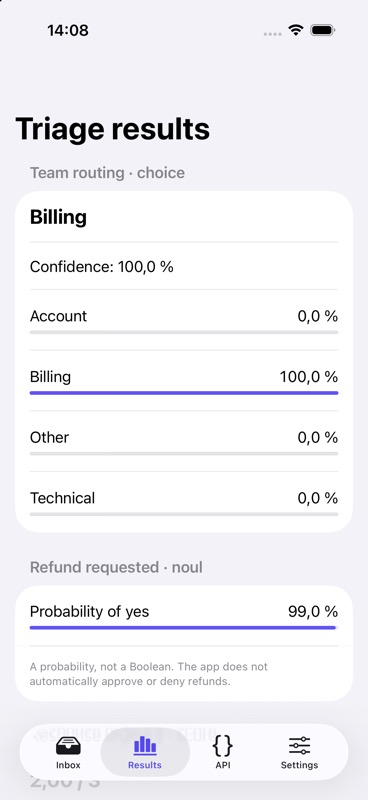

# Support Inbox Triage

An iOS/iPadOS 16+ SwiftUI example using the SDK in this repository through a **local SPM dependency**. Open `SupportInbox.xcworkspace` in Xcode. The app shell imports `SupportInboxFeature`, whose package depends on the root `TypeSafe` product. All Swift targets use Swift 6 language mode.

## What it demonstrates

| Question | Real use case | Output |
| --- | --- | --- |
| `choice` | Route a support ticket to billing, technical, account, or other | Category, confidence, probability bars |
| `noul` | Detect whether the customer explicitly requests money back | Probability of yes, not a Boolean or refund approval |
| `score` | Prioritize a human response using an impact/deadline rubric | Fractional expected score, confidence, legend, probabilities |

Presets cover a duplicate charge causing financial hardship, a team-wide login outage before a presentation, and a routine profile question. Edit the message to try your own synthetic examples. All three questions are sent in a single `systemOne` call with structured JSON state.

- **Inbox:** presets, editable message, analyze, and cancel.
- **Results:** all three answer variants, model, token usage, and request ID.
- **API:** request body preview and the actual response body, HTTP status, and request ID. `APIResponse.rawBody` preserves the server bytes; the UI pretty-prints them. Authentication headers are not displayed.
- **Settings:** fetch models with `models.list()`, select a model, set attempt timeout, and configure retries.

Errors and cancellation are shown in the UI. The app uses SwiftUI `.task(id:)` for lifecycle-bound work and main-actor-isolated UI state. It does not save keys, messages, or responses.

## Run with a real key in the simulator

Requirements: Xcode, an installed iOS simulator runtime, Python 3, and [XcodeBuildMCP](https://github.com/getsentry/XcodeBuildMCP).

1. Create `.env` at the **repository root**, not inside the example:

   ```dotenv
   TYPESAFE_API_KEY=your-local-key
   ```

   The launch helper also accepts `apiKey=...` for compatibility with the existing local file. Do not use both names. `.env` and `.env.*` are ignored, except the secret-free `.env.example` template.

2. Discover a simulator:

   ```sh
   xcodebuildmcp simulator list --enabled
   ```

3. Build and run from the repository root (replace `<UUID>`):

   ```sh
   xcodebuildmcp simulator build-and-run \
     --workspace-path "$PWD/Examples/SupportInbox/SupportInbox.xcworkspace" \
     --scheme SupportInbox \
     --simulator-id '<UUID>' \
     --derived-data-path "$PWD/Examples/SupportInbox/build"
   ```

4. Relaunch with credentials injected into the simulator process:

   ```sh
   python3 Examples/SupportInbox/launch-simulator.py --simulator-id '<UUID>'
   ```

5. Tap **Analyze ticket**. Visit **Settings → Refresh available models** to exercise the other endpoint.

Only a **Debug simulator build** reads `TYPESAFE_API_KEY` from its launch environment. The key is not compiled into the binary, copied into the bundle, stored in UserDefaults, or added to a shared Xcode scheme. Device and Release builds intentionally have no credentials and disable requests.

The helper captures CLI output and redacts the key before displaying it. Like any environment-based developer credential, it remains accessible to local development tools/process inspection. Do not enable verbose launcher logging with real credentials or share local tool diagnostics without checking them.

**This is not a production authentication pattern.** Use your backend for distributed apps with privileged shared keys. Submitted message text goes to TypeSafe; requests can incur charges, and retries may repeat processing/billing.

## Tests

SDK tests and feature tests use [Swift Testing](https://github.com/swiftlang/swift-testing). They never load `.env` or call the live API.

```sh
xcodebuildmcp swift-package test --package-path "$PWD"
xcodebuildmcp swift-package test \
  --package-path "$PWD/Examples/SupportInbox/SupportInboxPackage"
```

The workspace test plan includes the root SDK's unit and loopback HTTP integration tests, sample feature tests, and a credential-free **XCUITest** smoke test (Apple UI automation requires XCTest) that verifies missing credentials disable Analyze. Run the entire plan on the simulator:

```sh
xcodebuildmcp simulator test \
  --workspace-path "$PWD/Examples/SupportInbox/SupportInbox.xcworkspace" \
  --scheme SupportInbox \
  --simulator-id '<UUID>' \
  --derived-data-path "$PWD/Examples/SupportInbox/build"
```

UI tests relaunch without a key. Rerun `launch-simulator.py` afterward for manual live testing.

## Live verification

Verified on iPhone 17 Pro, iOS Simulator 26.4.1:

| Preset | Selected team | Refund probability | Expected urgency |
| --- | --- | --- | --- |
| Duplicate charge | billing | 99% | 2.00 / 3 |
| Login failure | technical | 1% | 3.00 / 3 |
| Account question | account | 1% | 0.00 / 3 |



These are observed live results, not hardcoded output or guaranteed future answers. The models endpoint returned `jev-latest` and `jev-preview`. Model release strings are displayed as returned by the service (currently timestamps).

### Local UI automation troubleshooting

If the current Xcode beta lacks `SimulatorKit.framework`, point **UI automation commands only** to an installed stable Xcode, for example:

```sh
DEVELOPER_DIR=/Applications/Xcode-26.6.0.app/Contents/Developer \
  xcodebuildmcp simulator snapshot-ui --simulator-id '<UUID>'
```

This was needed on the development machine for simulator accessibility inspection; builds and tests used the default Xcode. Do not assume that alternate Xcode path exists on other machines.
